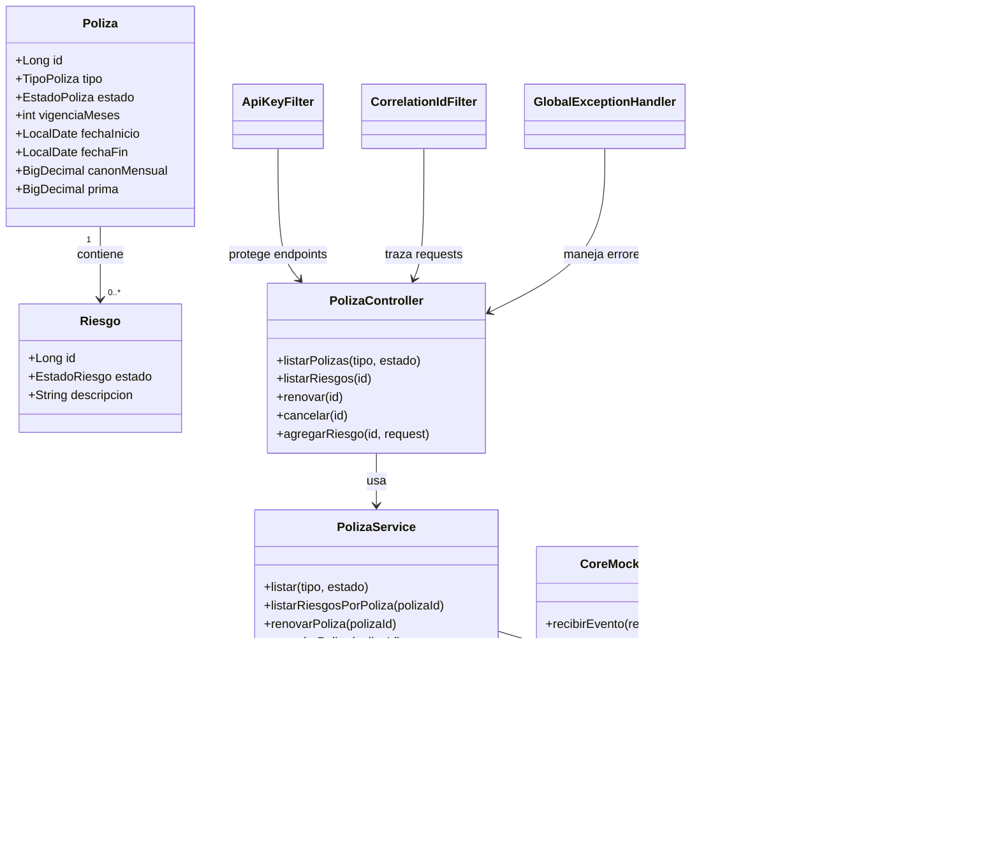
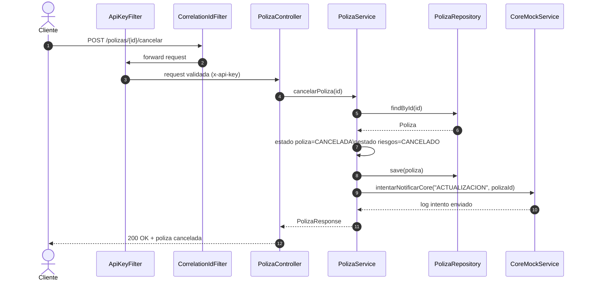

# UML - API de Gestion de Polizas

## Diagrama de Clases

```mermaid
classDiagram

class Poliza {
  +Long id
  +TipoPoliza tipo
  +EstadoPoliza estado
  +int vigenciaMeses
  +LocalDate fechaInicio
  +LocalDate fechaFin
  +BigDecimal canonMensual
  +BigDecimal prima
}

class Riesgo {
  +Long id
  +EstadoRiesgo estado
  +String descripcion
}

class PolizaController {
  +listarPolizas(tipo, estado)
  +listarRiesgos(id)
  +renovar(id)
  +cancelar(id)
  +agregarRiesgo(id, request)
}

class RiesgoController {
  +cancelarRiesgo(id)
}

class CoreMockController {
  +recibirEvento(request)
}

class PolizaService {
  +listar(tipo, estado)
  +listarRiesgosPorPoliza(polizaId)
  +renovarPoliza(polizaId)
  +cancelarPoliza(polizaId)
  +agregarRiesgo(polizaId, request)
}

class RiesgoService {
  +cancelarRiesgo(riesgoId)
}

class CoreMockService {
  +registrarEvento(request)
  +intentarNotificarCore(evento, polizaId)
}

class PolizaRepository
class RiesgoRepository
class ApiKeyFilter
class CorrelationIdFilter
class GlobalExceptionHandler

Poliza "1" --> "0..*" Riesgo : contiene
PolizaController --> PolizaService : usa
RiesgoController --> RiesgoService : usa
CoreMockController --> CoreMockService : usa
PolizaService --> PolizaRepository : consulta/persistencia
PolizaService --> RiesgoRepository : persistencia riesgo
PolizaService --> CoreMockService : notifica
RiesgoService --> RiesgoRepository : consulta/persistencia
RiesgoService --> CoreMockService : notifica
ApiKeyFilter --> PolizaController : protege endpoints
CorrelationIdFilter --> PolizaController : traza requests
GlobalExceptionHandler --> PolizaController : maneja errores
```

## Diagrama de Secuencia (Cancelar Poliza)

```mermaid
sequenceDiagram
  autonumber
  actor Cliente
  participant AK as ApiKeyFilter
  participant CID as CorrelationIdFilter
  participant PC as PolizaController
  participant PS as PolizaService
  participant PR as PolizaRepository
  participant CMS as CoreMockService

  Cliente->>CID: POST /polizas/{id}/cancelar
  CID->>AK: forward request
  AK->>PC: request validada (x-api-key)
  PC->>PS: cancelarPoliza(id)
  PS->>PR: findById(id)
  PR-->>PS: Poliza
  PS->>PS: estado poliza=CANCELADA\nestado riesgos=CANCELADO
  PS->>PR: save(poliza)
  PS->>CMS: intentarNotificarCore("ACTUALIZACION", polizaId)
  CMS-->>PS: log intento enviado
  PS-->>PC: PolizaResponse
  PC-->>Cliente: 200 OK + poliza cancelada
```
